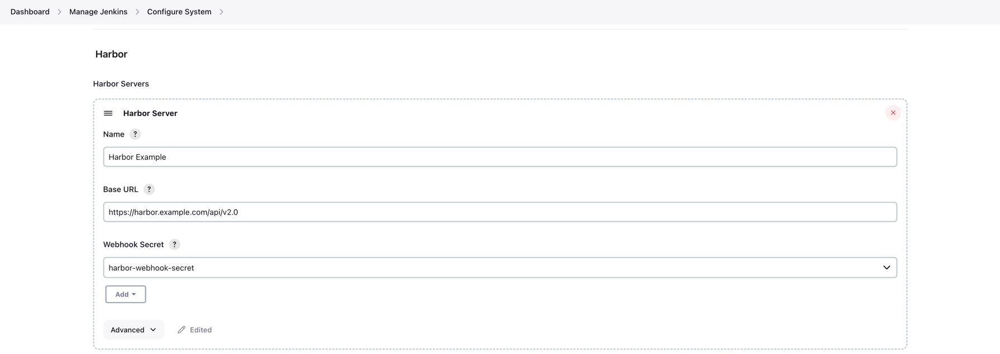
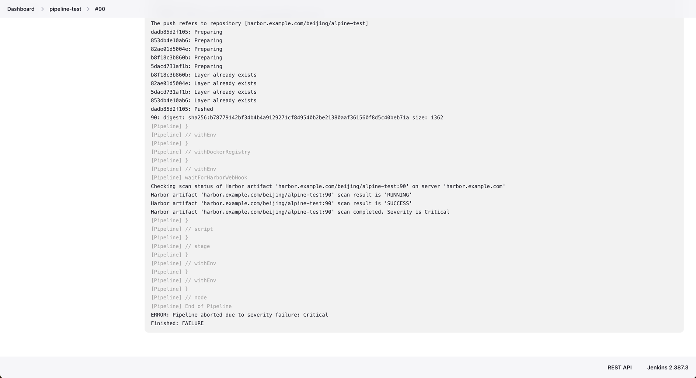

# harbor-plugin

## Introduction

The Harbor Plugin enables integration between Jenkins and Harbor services. It provides the capability to synchronize and asynchronously wait for Harbor image scan results during Jenkins pipelines. The plugin ensures pipeline execution is interrupted if any security risks are detected, while allowing the pipeline to continue if the image passes the security scan.

### Features

- Integration between Jenkins and Harbor services.
- Synchronize with Harbor for image scan results.
- Asynchronous waiting for scan results.
- Ability to interrupt pipeline execution for detected security risks.
- Seamless integration with Jenkins pipelines.

### Requirements

- Jenkins 2.x or later.
- Harbor service configured and accessible.

## Getting started

1. Install the Harbor Plugin on your Jenkins server.

2. Go to the global configuration and add Harbor Server Config.



> Webhook secret has not been implemented yet, please ignore the configuration.

3. Using Snippet Generator to Generate Code for Pipeline Testing.

```groovy
waitForHarborWebHook abortPipeline: true, credentialsId: 'harbor_credentials', server: 'Harbor Example', severity: 'Critical'
```

4. Execute the pipeline and wait for Harbor scan results. Based on the scan results, dynamically determine the status of the pipeline execution. If any security risks are detected during the scan, the pipeline will be marked as failed or interrupted. Conversely, if the image passes the security scan, the pipeline will continue its execution without interruptions.



## Acknowledgments

We would like to express our gratitude to the following projects and communities:

- [Harbor](https://goharbor.io/): We extend our heartfelt thanks to the Harbor project for providing an excellent open-source solution for private artifact repositories. Their contribution in addressing our private artifact management needs has been invaluable.

- [SonarQube](https://github.com/jenkinsci/sonarqube-plugin): We would like to acknowledge the SonarQube community for their remarkable SonarQube plugin implementation. We have drawn inspiration from their work during the development of this plugin, and it has greatly contributed to the functionality and quality of our integration.

## Contributing

Refer to our [contribution guidelines](https://github.com/jenkinsci/.github/blob/master/CONTRIBUTING.md)

## LICENSE

Licensed under MIT, see [LICENSE](LICENSE.md)

